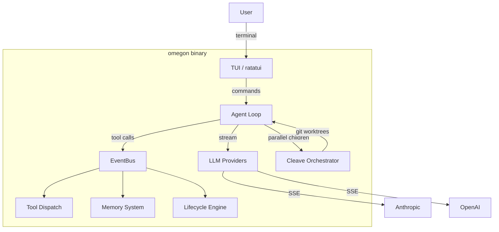

# Architecture

## Overview

Omegon is a Rust-native AI coding agent harness. Single statically-linked binary, no runtime dependencies. Communicates with LLM providers (Anthropic, OpenAI) via native HTTP clients, renders an interactive TUI via ratatui, and manages parallel task decomposition through git worktrees.

## Crate structure

| Crate | Purpose |
|-------|---------|
| `omegon` | Main binary — TUI, agent loop, providers, tools, CLI |
| `omegon-traits` | Shared traits — Feature, ToolProvider, ContextProvider, BusEvent |
| `omegon-memory` | Fact store, embeddings, episodes, recall, injection |
| `omegon-secrets` | Secret detection, redaction, tool guards, keyring integration |

## Agent loop

The core loop in `loop.rs`:

1. Assemble context (system prompt + conversation + tool defs + injections)
2. Stream LLM response with retry (exponential backoff on transient errors)
3. Parse response — text, thinking, tool calls
4. If tool calls: dispatch via EventBus → collect results → loop
5. If text only: check for uncommitted mutations → nudge or break
6. Emit turn events for TUI and bus features

### Idle timeout protection

All streaming layers have idle timeouts to prevent indefinite hangs:
- SSE byte stream: 90s
- LLM event channel: 120s
- Subprocess bridge: 120s

## EventBus

The `EventBus` is the central dispatch for tools, features, and context:

- **Features** implement the `Feature` trait — register tools, handle events, inject context
- **Tools** are dispatched through `execute_tool()` — routed to the owning feature
- **Context** is collected from all features via `provide_context()` each turn
- **Commands** (slash commands) are dispatched to the feature that registered them

## Lifecycle engine

Two parallel systems track work:

- **Design tree** — markdown frontmatter docs in `docs/`, status progression (seed → exploring → resolved → decided → implementing → implemented)
- **OpenSpec** — spec-driven implementation changes with Given/When/Then scenarios, task decomposition, verification

## Cleave orchestrator

Parallel task execution via git worktrees:

1. Parse plan (children with labels, descriptions, scopes, dependencies)
2. Create worktree per child
3. Spawn child `omegon` processes with per-child task files
4. Monitor progress, enforce timeouts (wall-clock + idle)
5. Merge completed worktrees back to parent branch
6. Report results

## Providers

Native HTTP clients for LLM streaming:

| Provider | Auth | Streaming |
|----------|------|-----------|
| Anthropic | API key or OAuth (Claude Code compat) | SSE via Messages API |
| OpenAI | API key | SSE via Chat Completions API |
| Subprocess bridge | Delegates to Node.js | JSON-RPC over stdin/stdout |
